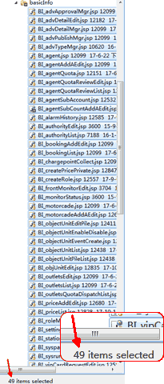
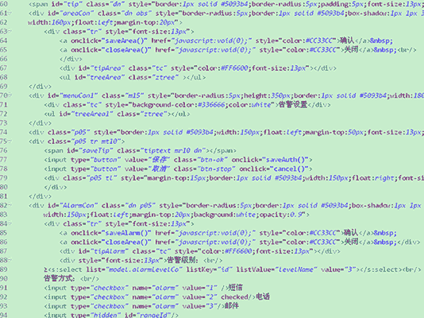
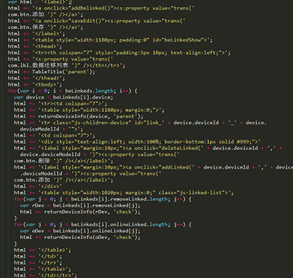
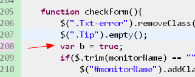

# code-guide Web 前端代码规范
    @Version: 1.0 Beta
    @Author: Wing Meng
    @Update: 2017-11-08
---
完整版查看地址：[https://wingmeng.github.io/code-guide/](https://wingmeng.github.io/code-guide/)

## 目录
- [文件/资源命名规范](https://wingmeng.github.io/code-guide/index.html#fileNaming)
- [HTML 规范](https://wingmeng.github.io/code-guide/index.html#menuHtml)
- [CSS, SCSS 规范](https://wingmeng.github.io/code-guide/index.html#menuCSS)
- [JavaScript 规范](https://wingmeng.github.io/code-guide/index.html#menuJS)

## 唏嘘的过往
先上图感受下没有代码规范的以往项目：

- 未分类且命名杂乱的项目文件，**找文件效率极低** :sob:

    

- 结构、样式、事件耦合在一起的代码，**毫无维护性可言** :fearful:

    

- 缩进、空格、换行混乱，代码排版凌乱不堪，**可读性极差** :scream:

    

- 不规范的命名，极易造成代码冲突，**引发低级 bug** :weary:

    

## 希冀的未来
1. 好的代码规范可以尽可能的减少项目维护成本；
2. 好的代码规范可以改善代码的可读性，提高协作开发效率；
3. 好的代码规范可以减少低级 bug 的出现概率；
4. 长期的规范性编码还可以让开发人员养成好的编码习惯，甚至锻炼出更加严谨的思维。